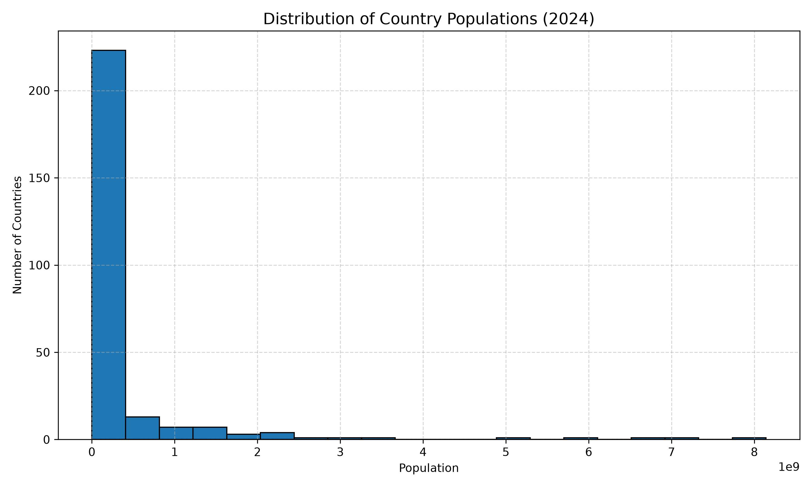

# World Population Analysis

## Objective

The objective of this project is to visualize the distribution of population across countries using World Bank population data.

## Dataset

Source: World Bank

Indicator: SP.POP.TOTL (Population, Total)

Dataset Link:
https://data.worldbank.org/indicator/SP.POP.TOTL

## Tools Used

* Python
* Pandas
* Matplotlib
* GitHub

## Project Steps

1. Downloaded World Bank population dataset.
2. Loaded the dataset using Pandas.
3. Cleaned the data by removing missing values.
4. Extracted population values for 2024.
5. Created a histogram to visualize the distribution of country populations.
6. Saved the visualization as histogram.png.

## Visualization

### Population Distribution Histogram

## Key Findings

* Population distribution is highly right-skewed.
* Most countries have relatively small populations.
* A small number of countries account for a large share of the world's population.

## Author

Snigdha
